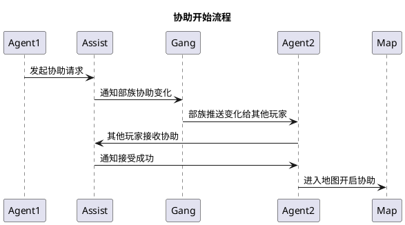

```plantuml
@startuml
title: 协助开始流程
Agent1 -> Assist : 发起协助请求
Assist -> Gang : 通知部族协助变化
Gang -> Agent2 : 部族推送变化给其他玩家
Agent2 -> Assist : 其他玩家接收协助
Assist -> Agent2 : 通知接受成功
Agent2 -> Map : 进入地图开启协助
@enduml
```