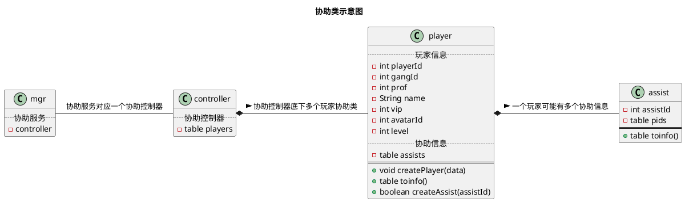

需求简析：
  
  项目缺少一个协助功能，当在部族中的玩家发起一个协助请求时，在部族的其他玩家可以看到请求列表，并选择是否前往协助。确认前往协助后切入求助者地图参与协助，直到请求者放弃协助、协助者停止协助，其他因素导致的协助停止，或者协助完成。协助完成，发放协助奖励。

分析：
  分析具体需求文档后，将主要的类设计如下图：

```plantuml
@startuml
title: 协助类示意图

Class mgr {
	.. 协助服务 ..
	- controller
}

Class controller {
	.. 协助控制器 ..
	- table players
}

Class player {
	.. 玩家信息 ..
	- int playerId
	- int gangId
	- int prof
	- String name
	- int vip
	- int avatarId
	- int level
	.. 协助信息 ..
	- table assists
	==
	+ void createPlayer(data)
	+ table toinfo()
	+ boolean createAssist(assistId)
}

Class assist {
	- int assistId
	- table pids
	==
	+ table toinfo()
}

mgr - controller : 协助服务对应一个协助控制器
controller *- player : 协助控制器底下多个玩家协助类 >
player *- assist : 一个玩家可能有多个协助信息 >
@enduml
```