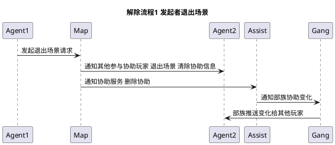
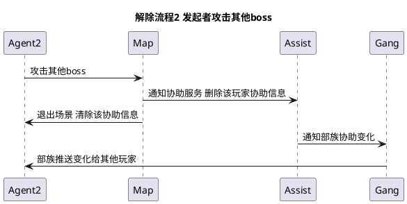
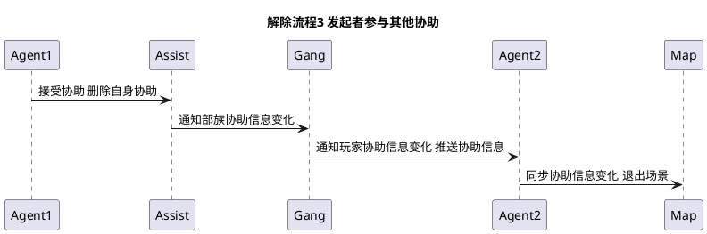
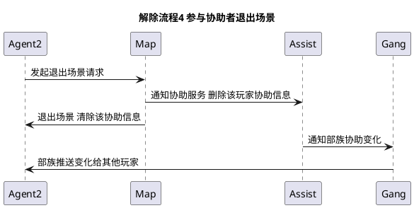
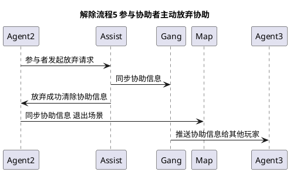
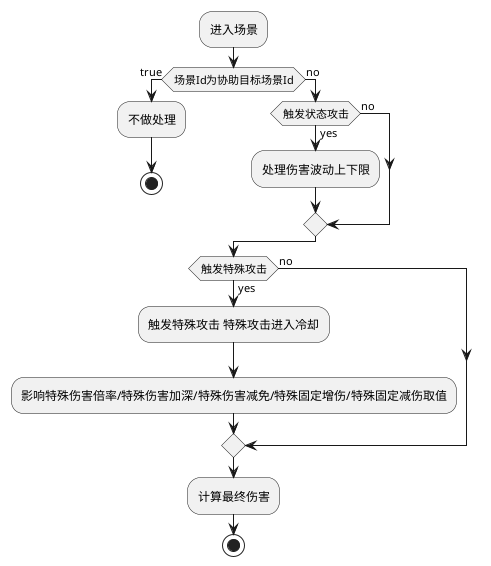

解除流程1：当发起者退出场景时，协助任务直接失效，所有参与当前协助的玩家结束当前协助。同时其他玩家也不能再接取当前协助任务。

解除流程2：当发起者攻击当前协助指定boss之外的其他boss时，自动结束当前协助，同时所有参与协助的玩家结束当前协助，其他玩家不能再接取当前协助。

解除流程3： 发起者接取了其他玩家发布的协助任务时，结束当前协助，同时所有参与协助的玩家结束当前协助，其他玩家不能接取。

解除流程4： 参与协助玩家退出场景，自动结束自身当前协助，其他玩家可以继续接取和完成协助。

解除流程5： 参与协助玩家 主动放弃协助，结束当前协助，其他玩家可以继续接取和完成协助。

切图判断逻辑
