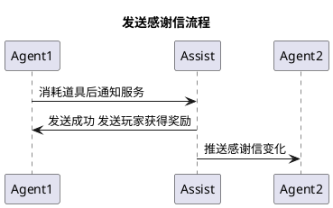
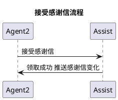

  协助结束后，发起协助的玩家获得一个道具，使用该道具后会向协助他完成任务的玩家发送一封感谢信。 策划需求，只需要记录上一次协助信息即可，多次未发送则都发向最近一次参与协助玩家。

```plantuml
@startuml
title: 发送感谢信流程
Agent1 -> Assist : 消耗道具后通知服务
Assist -> Agent1 : 发送成功 发送玩家获得奖励
Assist -> Agent2 : 推送感谢信变化
@enduml
```

  协助其他玩家结束后，可能会获得发起者发送的感谢信，领取可获得对应奖励。协助服务中，有协助的玩家对象上存有对应的奖励数据。

```plantuml
@startuml
title: 接受感谢信流程
Agent2 -> Assist : 接受感谢信
Assist -> Agent2 : 领取成功 推送感谢信变化
@enduml
```
