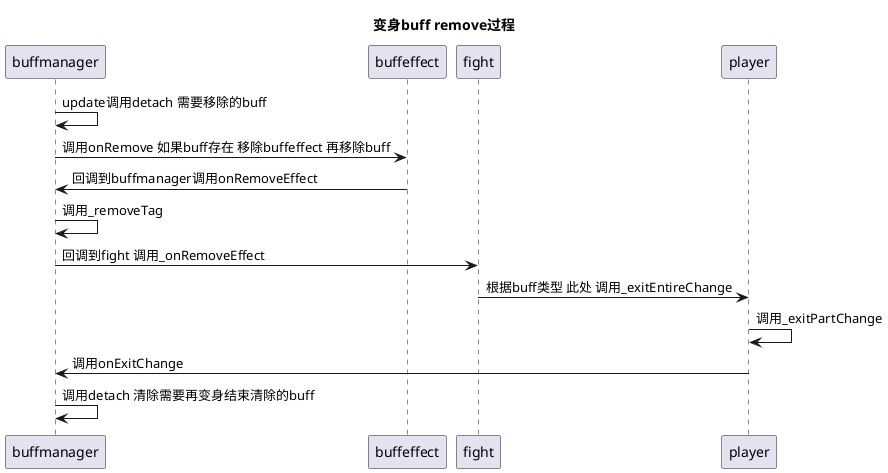

# 事故

变身buff消失时 服务器宕机

# 代码处理流程

```plantuml

@startuml
title : 变身buff remove过程

buffmanager -> buffmanager : update调用detach 需要移除的buff

buffmanager -> buffeffect : 调用onRemove 如果buff存在 移除buffeffect 再移除buff

buffeffect -> buffmanager : 回调到buffmanager调用onRemoveEffect

buffmanager -> buffmanager : 调用_removeTag

buffmanager -> fight : 回调到fight 调用_onRemoveEffect

fight -> player : 根据buff类型 此处 调用_exitEntireChange

player -> player : 调用_exitPartChange

player -> buffmanager : 调用onExitChange 

buffmanager -> buffmanager : 调用detach 清除需要再变身结束清除的buff

@enduml
```

# 结果分析

变身buff配置了一行 “退出变身是否清除” 为真 导致最后一步清除buff的时候清除自身 进入死循环。

# 解决方法

配置中变身buff本身 “退出变身是否清除” 配置为false即可

