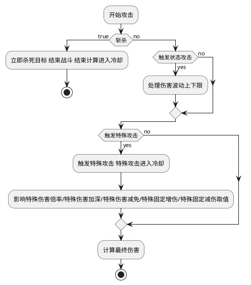

```plantuml
@startuml

:开始攻击;
if (斩杀) then (true)
	:立即杀死目标 结束战斗 结束计算进入冷却;
	stop
else(no)
	if (触发状态攻击) then (yes)
		:处理伤害波动上下限;
	else(no)
	endif
endif
if (触发特殊攻击) then (yes)
	:触发特殊攻击 特殊攻击进入冷却;
	:影响特殊伤害倍率/特殊伤害加深/特殊伤害减免/特殊固定增伤/特殊固定减伤取值;
else(no)
endif
:计算最终伤害;
stop
@enduml
```