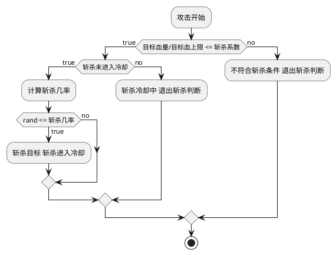

```plantuml
@startuml

:攻击开始;
if (目标血量/目标血上限 <= 斩杀系数) then (true)
	if (斩杀未进入冷却) then(true)
		:计算斩杀几率;
		if (rand <= 斩杀几率) then(true)
			:斩杀目标 斩杀进入冷却;
		else(no)
		endif
	else(no)
		:斩杀冷却中 退出斩杀判断;
	endif 
else(no)
	:不符合斩杀条件 退出斩杀判断;
endif
stop
@enduml
```