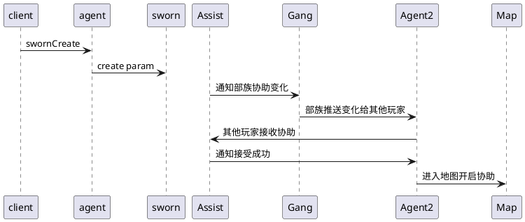

title: 结拜
categories: 
- sg
- sworn
tags:
- sg
- sworn
date: 2020-01-12
---

## 基础方法

### create

----
### cancel

----
### invite

----
### cancelInvite

----
### reply

----
### leave

----
### kickOut

----
### getList

----
### toast

----
### apply

----
### applyReply

----
### getBeInviteInfos

----
### getApplyInfos

----
### getSwornData

----
### replyCheck

----
### getMemberSize

----
### getMemberIdsByUid

----
### toastCheck

----